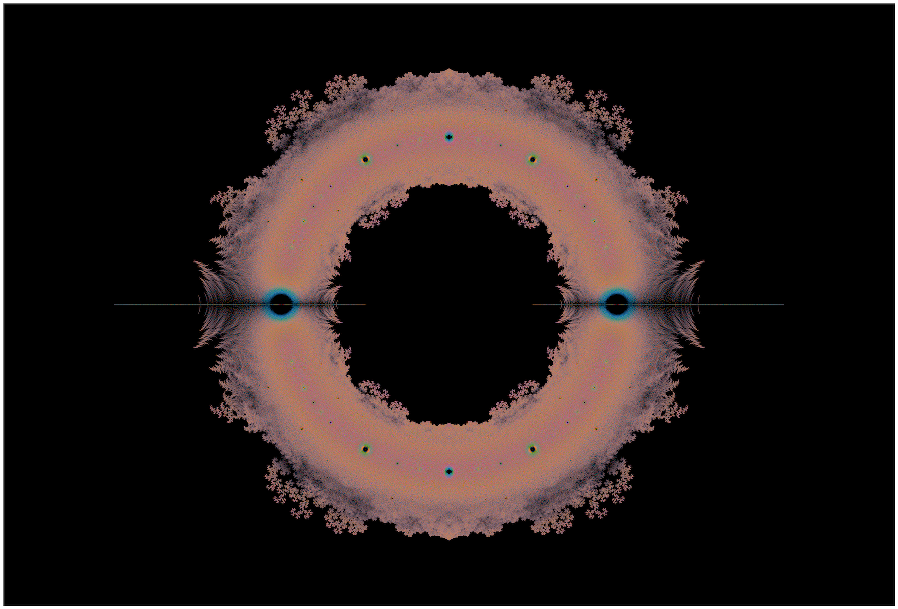
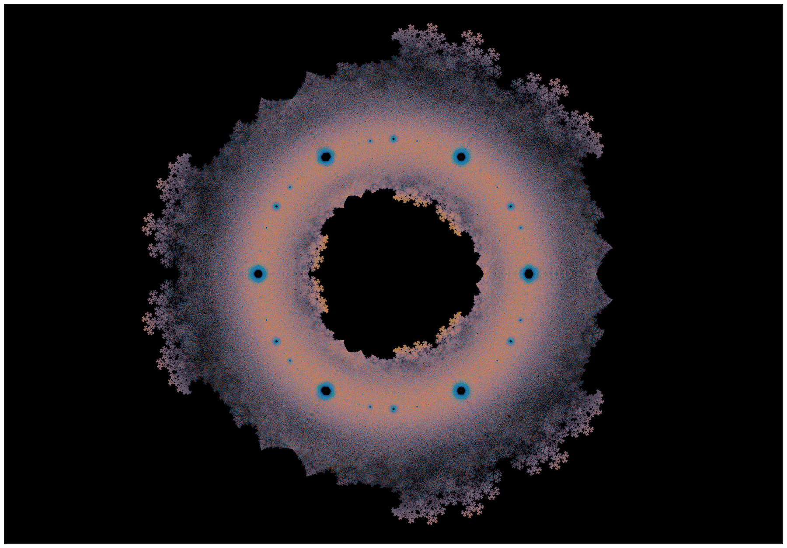

# littlewood

[Littlewood polynomials][wikipedia] are polynomials with coefficients that are all ±1.  For a fixed degree, we can generate all such polynomials, find their roots, and plot them on the complex plane, which results in a beautiful structure.



In the above figure I plotted all the roots of all the polynomials of degree up to and including 20, each degree a different color.

I first learned about this beautiful object from [This Week's Finds 285][ncategory-cafe], and I started making similar figures recreationally, generalizing to allow coefficients to be not just ±1 but the nth roots of unity.

When we look at the third roots of unity, we find a similar structure, but rather than 2-fold symmetry we see a 3-fold symmetry!  Below, I plotted all the roots of all the polynomials of degree up to 12.



Recently, the roots of Littlewood polynomials were featured on [Curiosa Mathematica][curiosa-mathematica], which inspired me to write a nice python package that facilitates the creation of pictures of these structures.

# Python package

Previously I had made figures of this kind in `Mathematica`, but it was struggling to produce very large images.  This `python` module provides almost the same functionality.

After it is `pip3 install`ed, you can invoke `littlewood`, a provided script to produce images.

For example, to produce something like the first image above, one invokes
```bash
littlewood --data littlewood.h5 --degree 1 20   \
           --coefficients littlewood            \
           --show points l2-d1to20.png
```
which will read already-computed roots for each degree from 1 to 20 from `littlewood.h5` if available and otherwise will calculate them and store them in that file, and then save a scatter plot of the roots to `l2-d1to20.png`.  See `littlewood --help` for additional details and options.

Rather than use the script, one may also `import littlewood` to iterate over polynomials, solve them, etc. and then manipulate their roots to your hearts content.

# Animations

Rather than staying limited to fixed coefficients, we can visualize how the roots change as we change the coefficients.  In particular, we can let the coefficients change with time and make a movie!  Letting time go from 0 to 1, we can pick the coefficients to be `exp(2πi time range(symmetry))` where the figure will reflect the symmetry at integer multiples of `1/symmetry` in time.

These may be visualized using `littlewood-morph`.  The options and flags are explained in the `--help`.
The most animation-specific option, `--layer`, indicates you want see multiple sweeps through time, each time adding the next degree.
So

```bash
littlewood-morph lz2d6.mp4 --symmetry 2         \
                           --degree 1 6         \
                           --steps 1000         \
                           --layer              \
                           --data ./morph.h5
```

yields

NB: These movies require a LOT more storage, compared to storing the data for the stills of Littlewood polynomials of the same degree.

# LICENSE

`littlewood` is (C) Evan Berkowitz 2019, released under [GPLv3][GPLv3], which is provided in `LICENSE`.  Any images provided in this repository are [CC BY-SA 4.0][CC].
I ask that you maintain the artist metadata on any generated movies.


[CC]:                   https://creativecommons.org/licenses/by-sa/4.0/deed.en
[curiosa-mathematica]:  http://curiosamathematica.tumblr.com/post/183919590932/curiosamathematica-littlewood-polynomials-are
[GPLv3]:                https://www.gnu.org/licenses/gpl-3.0.en.html
[ncategory-cafe]:       https://golem.ph.utexas.edu/category/2009/12/this_weeks_finds_in_mathematic_46.html
[wikipedia]:            https://en.wikipedia.org/wiki/Littlewood_polynomial
